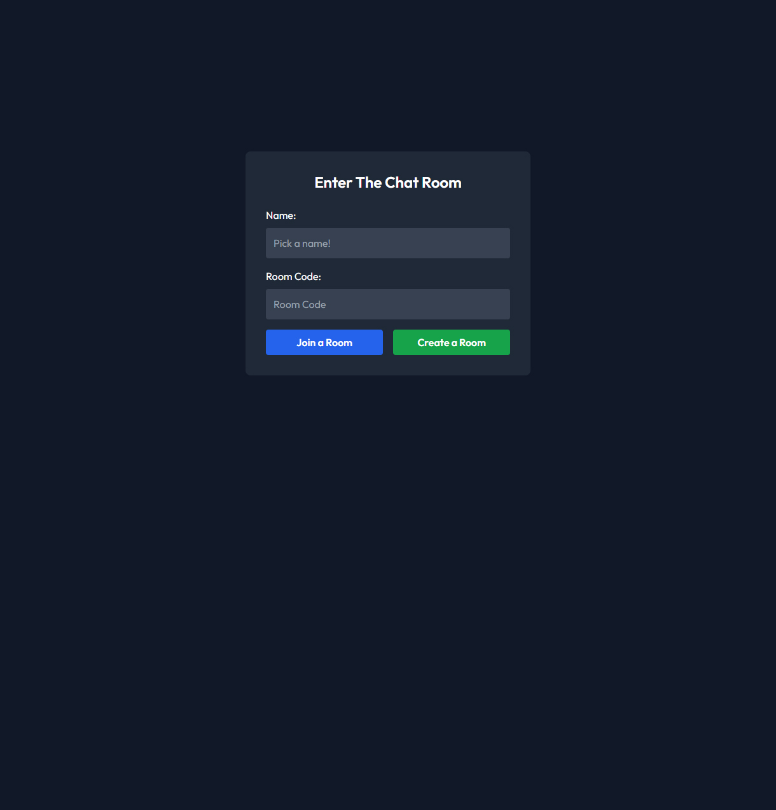
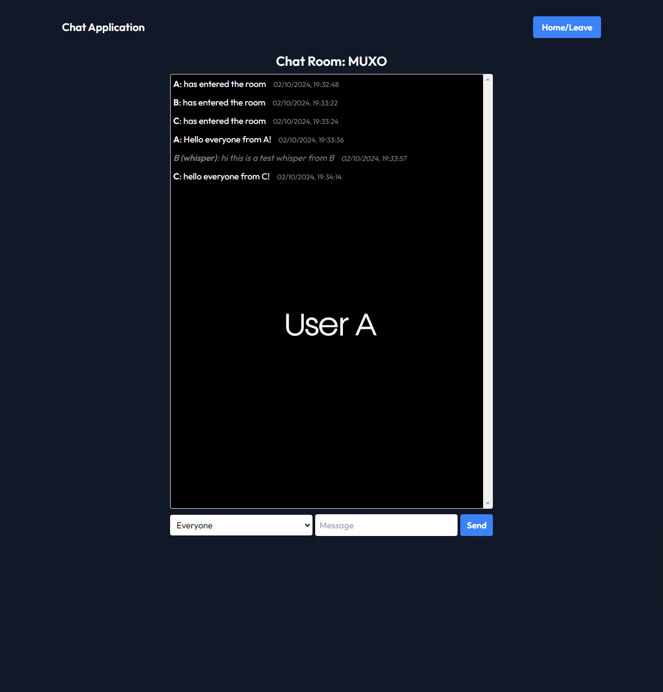
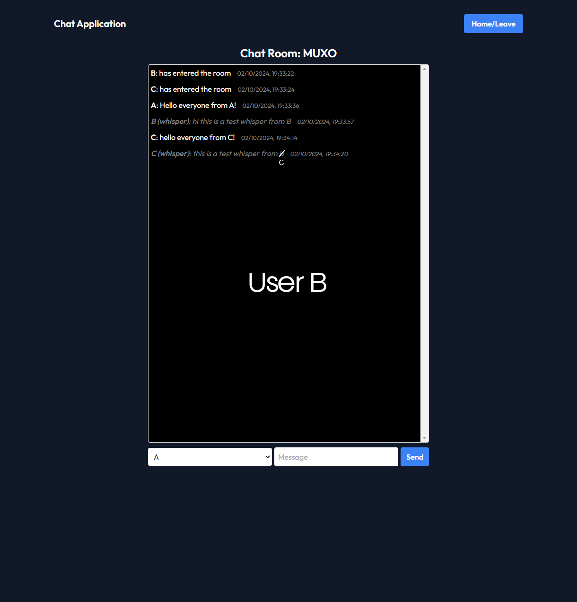
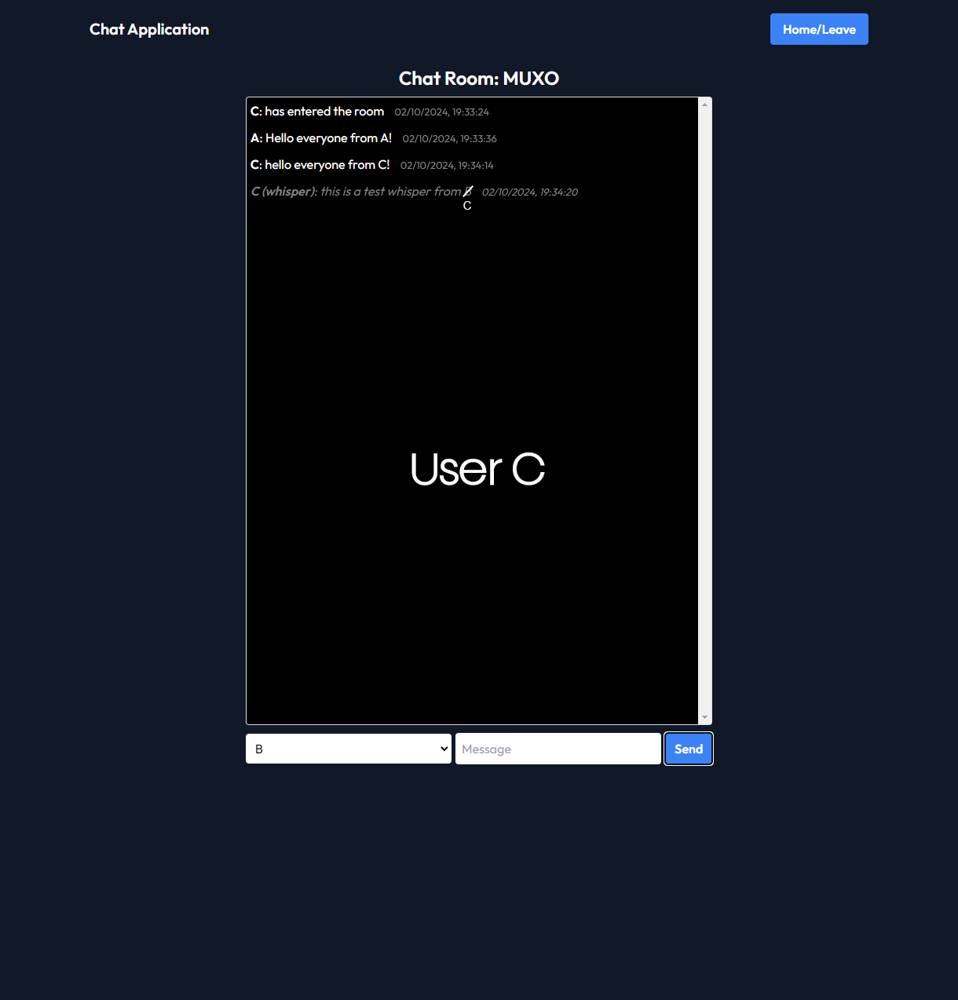

# OLAF Neighbourhood Protocol Implementation
This project implements a secure chat application using the OLAF Neighbourhood Protocol with Flask and Socket.IO. The application supports secure public and private messaging, room creation, and user authentication through RSA key pairs.

## Features
- **RSA Key Generation**: Clients generate their own RSA key pairs for secure communication.
- **Public and Private Chat**: Supports both public broadcasting and private (whisper) messages.
- **Room Management**: Users can create, join, and leave chat rooms.
- **Persistence**: Rooms remain open even if all users leave, allowing them to rejoin later.

> **Note:** This version of the code intentionally includes vulnerabilities for educational purposes, as part of the assignment's requirements.

## Installation
Ensure you have Python and `pip` installed. Then, run the following commands to install the necessary dependencies:

```bash
pip install flask
pip install flask_socketio
pip install cryptography
pip install pycryptodome
pip install canonicaljson
pip install eventlet
```

## How to Run the Server
1. Navigate to the directory where `main.py` is located.
2. Run the server with:
    ```bash
    python main.py
    ```
3. In the terminal, CTRL + Click the link to `localhost:5000` to open the application in your browser.

## Testing
1. Open two browser windows: one in regular mode and one in incognito mode.
2. In one tab, enter a name and create a room.
3. Copy the room code to your clipboard.
4. In the other tab, enter a name and use the room code to join the room.
5. Test public chatting and private chatting (whispers), and try leaving and rejoining rooms.

> **Note**: For more than two users, use multiple browsers due to Flask's session management limitations.

## Persistence
- Rooms are designed to remain open even when all users leave. This allows users to rejoin the room later and continue their conversation.

## Project Structure
- `main.py`: The main server code implementing the chat application with vulnerabilities for educational review.
- `templates/`: Contains HTML templates (`base.html`, `home.html`, `room.html`) for rendering the UI.
- `static/css/`: Contains `style.css` for styling the chat application.

## Vulnerabilities
This code version intentionally includes two vulnerabilities to meet the assignment's requirements.

## Usage Notes
- **Testing**: The vulnerabilities mentioned above should only be tested in a controlled environment for educational purposes. The code is not suitable for production use.
- **Room Code**: The room code can be copied and shared to allow other users to join a specific room.
- **Whisper**: To send a private message, select a recipient from the dropdown menu.

## Screenshots

### 1. Home Screen
The home screen allows users to pick a name and either create a new room or join an existing one using a room code.



### 2. User A Creating a Room
User A creates a room and sends a public message to everyone in the room: "Hello everyone from A!"



### 3. User B Whispering to User A
User B joins the room and whispers to User A: "hi this is a test whisper from B." Only User A can see this message.



### 4. User C Joining and Messaging
User C joins the room, sends a public message: "hello everyone from C," and then whispers to User B: "hello this is a test whisper from C."



### Explanation
- As shown in the screenshots, **public messages** (e.g., "Hello everyone from A" and "Hello everyone from C") are visible to all users in the room.
- **Whispers** are private messages that can only be seen by the intended recipient:
  - User A does not receive User C's whisper to User B.
  - Similarly, User C does not receive User B's whisper to User A.
- This illustrates how the application maintains **message privacy** for whispers, ensuring only the sender and intended recipient can see the content of private messages.

These screenshots provide a visual overview of the chat application's UI and its handling of public messages and whispers, highlighting its capability to manage private communications securely within a room.

## License
This project is developed for educational purposes and is not intended for commercial use. 

## Contributors/Authors

- **Elliot Koh**
- **Bryan Van**
- **Leo Nguyen**
- **Nathaniel Cordero**

### Group Contact

- **Discord ID**: proximobinks